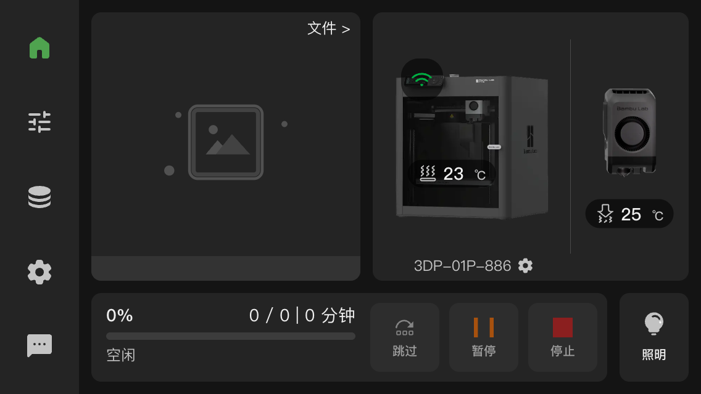
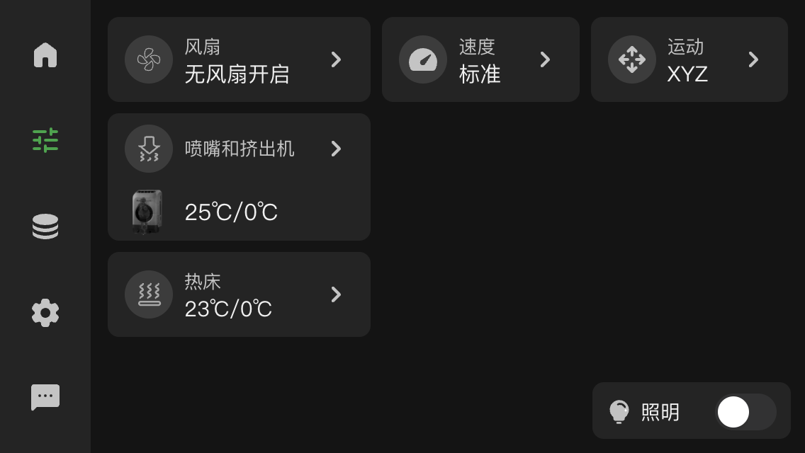
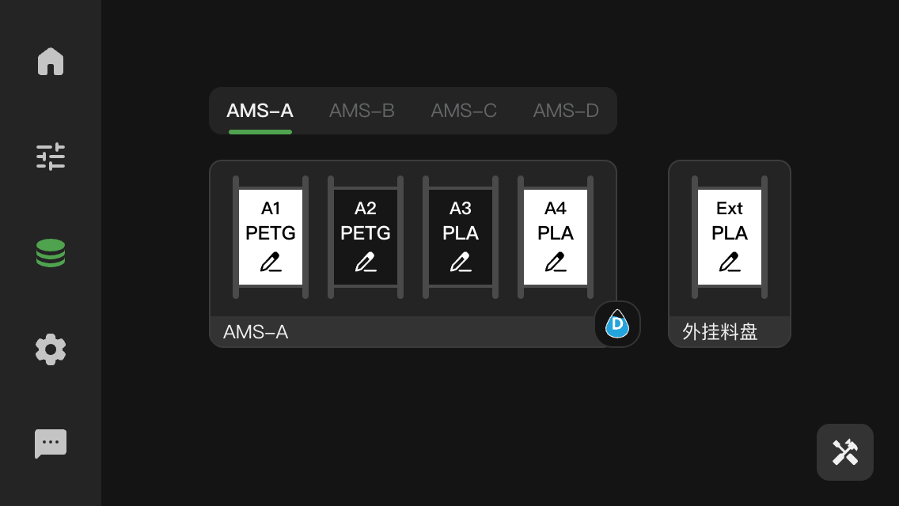

# bambulab-p1screen

[English](./README.md) | [简体中文](./README.zh.md)

[](./LICENSE)
[](https://vuejs.org/)
[](https://vitejs.dev/)
[](https://github.com/0x5e/bambulab-p1screen/pkgs/container/bambulab-p1screen)
[](https://github.com/0x5e/bambulab-p1screen/actions/workflows/npm-build.yml)

Control screen software for the Bambu Lab P1 series upgrade kit.

Status: In development

## Screenshots





## Feature List
- Home
  - Print progress
- Controls
  - Nozzle temperature
  - Bed temperature
  - Fan speed
  - Print speed
  - Light
  - XY motion (X/Y)
  - Bed lift (Z)
  - Extruder (E)
- Filament
  - AMS trays
  - External tray
  - Tools
  - Guide
- Settings
  - Network info
  - Device info
  - Accessory info
  - Calibration
- Files
  - File list

## Highlights
- Minimum supported resolution: 568x320 (iPhone 5 size)
- Lower runtime overhead (compared to Home Assistant Web/App), suitable for older devices (Redmi 2 runs smoothly)

## Other Options
- Bambu Handy: Official app does not support landscape well; performance on older devices is untested.
- 3D Apollo: Feature-rich and works well on older devices. Overall UI style (white/yellow) does not match the printer style very well.
- Home Assistant Web/App: High performance overhead (for unknown reasons). Redmi 2 is unusable and may freeze.

## Usage
### Android App
[Download Link](https://github.com/0x5e/bambulab-p1screen/releases)

### Web
#### 1. Deploy backend service
Deploy the backend service on any device in the same LAN as the printer (mainly MQTT forwarding):

##### Option 1: npm

```bash
npm install
npm run build
npm run start
```

##### Option 2: Docker
```bash
docker run -d ghcr.io/0x5e/bambulab-p1screen:latest
```

##### Option 3: Docker Compose
Use the provided [docker-compose.yml](./docker-compose.yml):

```bash
docker compose up -d
```

#### 2. Add a home screen shortcut on mobile
Access URL:

`http://<server-address>:<port>/`

Default port: `8888`

- iOS: Safari -> Share -> Add to Home Screen -> enable “Open as Web App”
- Android: You can use [web-to-app](https://github.com/shiahonb777/web-to-app/) to create a full-screen home shortcut

Any full-screen web launch method is acceptable. More ideas are welcome.

## Hardware
- [P1S Screen Mod - Redmi 2 Direct Power Version](https://makerworld.com.cn/zh/models/2134336)
- [P1S Screen Mod - iPhone 7/Plus Version](https://makerworld.com.cn/zh/models/1945893)

## TODOs
- Filament
  - Filament edit, load/unload, settings, guidance
- Files
  - Fetch file list
- Multi languages

## References
- [P1 Screen Operation Guide](https://wiki.bambulab.com/en/p1/manual/screen-operation)
- [P2S Screen Operation Guide](https://wiki.bambulab.com/en/p2s/manual/screen-operation)
- [LAN Control Protocol Docs (OpenBambuAPI)](https://github.com/Doridian/OpenBambuAPI/)
- [LAN Control Protocol Implementation (bambulabs_api)](https://github.com/BambuTools/bambulabs_api)
- [Print State Constants (ha-bambulab)](https://github.com/greghesp/ha-bambulab/blob/main/custom_components/bambu_lab/pybambu/const.py)
